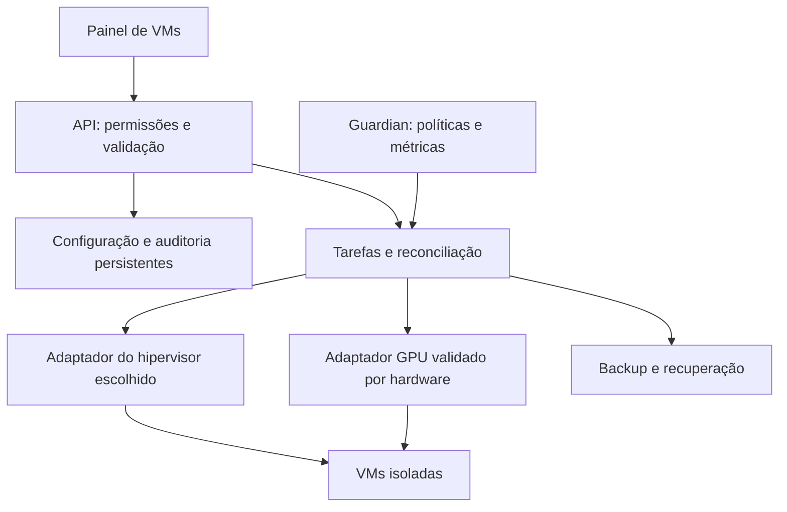

# Arquitetura — revisão 2

**Base de desenvolvimento: Fedora/uCore HCI**, autorizada por Danilo; homologação final pendente. Veja [a decisão e o build](BASE_FEDORA.md). A proposta de adotar MOS/Devuan por padrão foi substituída pelo foco em virtualização e compartilhamento de hardware.

## Escolha por capacidade

Avaliar GPU simultânea comprovada, controle CPU/RAM, guests Linux/Windows, isolamento, manutenção, licenciamento, build e custo. Registrar decisão e evidências antes da implementação.

MOS/Devuan, Linux/KVM, Proxmox e alternativa Windows/Hyper-V são candidatos de avaliação, não afirmações de suporte ao hardware do usuário. Se a escolha mudar a proposta de distribuição aberta, exigir decisão explícita.

## Componentes propostos

Adaptadores usam contratos tipados. Uma autoridade coordena operações por VM/dispositivo; não colocar dois controladores disputando o mesmo recurso.

Estado distingue intenção, gravação e aplicação observada. Gravação exige releitura; aplicação exige verificação no hipervisor. Tarefas têm ID, timeout e recuperação. Restauração verifica identidade da execução e alterações externas.

## Contrato de recursos

| Recurso | Configuração | Estado observado |
| --- | --- | --- |
| CPU | vCPUs, prioridade, capacidade máxima e afinidade opcional | Uso, quota efetiva e disponibilidade do host |
| RAM | Mínimo/inicial/máximo, reserva e margem do guest | Atribuição, disponibilidade e suporte das métricas |
| GPU | Placa/unidade virtual, perfil suportado e prioridade quando disponível | VMs usuárias, driver, VRAM e métricas realmente expostas |

Não inventar percentuais GPU/VRAM configuráveis se o mecanismo não permitir. Compartilhamento simultâneo pode depender de perfis fixos e não implica redistribuição dinâmica de todos os recursos da placa.

## Fluxo central

Criar VM → quantidade de CPU → faixa de RAM → GPU compartilhada compatível → acesso local/remoto → revisar reserva → salvar/criar.

Exemplo ilustrativo: duas VMs com 8 vCPUs e RAM 4/8/16 GiB cada. A capacidade CPU é distribuída por prioridade. A memória inicial precisa caber no orçamento do host; crescimento depende de capacidade confirmada. GPU só oferece combinações verificadas. Não é recomendação para qualquer máquina.

Mostrar limite configurado/aplicado, uso e motivo da última ação. Pausar mantém ajustes; restaurar verifica conflitos e capacidade. Editor não apaga configurações avançadas silenciosamente.

## Segurança e laboratório

Autenticação, papéis, tokens com escopo, logs sem segredos e API sem shell arbitrário. Atualizações com origem/assinatura e recuperação de configuração. Backups informam consistência. Falha GPU mantém um caminho administrativo independente daquela placa.

Usar guests/discos descartáveis. Virtualização aninhada ajuda no contrato/API, mas não certifica GPU. Testes físicos por modelo, firmware, driver, guest e hipervisor. RTX 3080 Ti/RX 550 não estão homologadas. Não alterar produção ou firmware sem autorização específica.

Duas pessoas usam VMs separadas e entrada/áudio independentes; streaming não comprova GPU compartilhada. NAS/apps/cluster ficam fora do caminho crítico.

## Implementação atual

O protótipo começa pelo Containerfile e mídia bootc/QCOW2. O fluxo pretendido é boot direto pela mídia preparada e configuração web, conforme [BOOT_MEDIA.md](BOOT_MEDIA.md). ISO é opcional; a base imutável não comprova execução integral em RAM nem persistência adequada a pendrive comum.

O [agente local](AGENT.md), em Python, consulta `virsh --readonly` com timeout e UUID. O serviço grava snapshot atômico em `/run/storos`, e o estado básico de boot persiste em `/var/lib/storos`.

A fundação da configuração persistente é descrita em [CONFIGURATION.md](CONFIGURATION.md). Ela separa **estado observado** do agente de **intenção/configuração** persistente. `current.json` é o ponteiro ativo; revisões são gravadas por geração antes da troca atômica do estado atual. Atualizações podem exigir `expected_generation` para rejeitar concorrência obsoleta, e rollback cria uma nova geração em vez de reescrever histórico.

O primeiro `storos-web.service` é deliberadamente somente leitura: entrega o snapshot e a configuração ativa, exige autenticação para dados administrativos e bloqueia métodos mutáveis. Por padrão escuta apenas no loopback. A flag `features.vm_write_enabled` é validada como `false`; portanto a existência do painel não concede autoridade para modificar VMs. A futura API de tarefas/reconciliação só poderá habilitar escrita após contratos, auditoria e validação separados.

Painel e agente têm ciclos de prontidão independentes. O painel **solicita** `storos-agent.service`, mas não serializa seu próprio start atrás dele; após `network.target`, pode inicializar configuração/token e responder `/api/config` enquanto o agente ainda coleta o primeiro snapshot. `/api/status` representa estado observado e pode retornar `503` nesse intervalo. Essa separação impede que aquecimento lento do libvirt bloqueie o caminho administrativo autenticado sem mascarar a indisponibilidade temporária do inventário.
