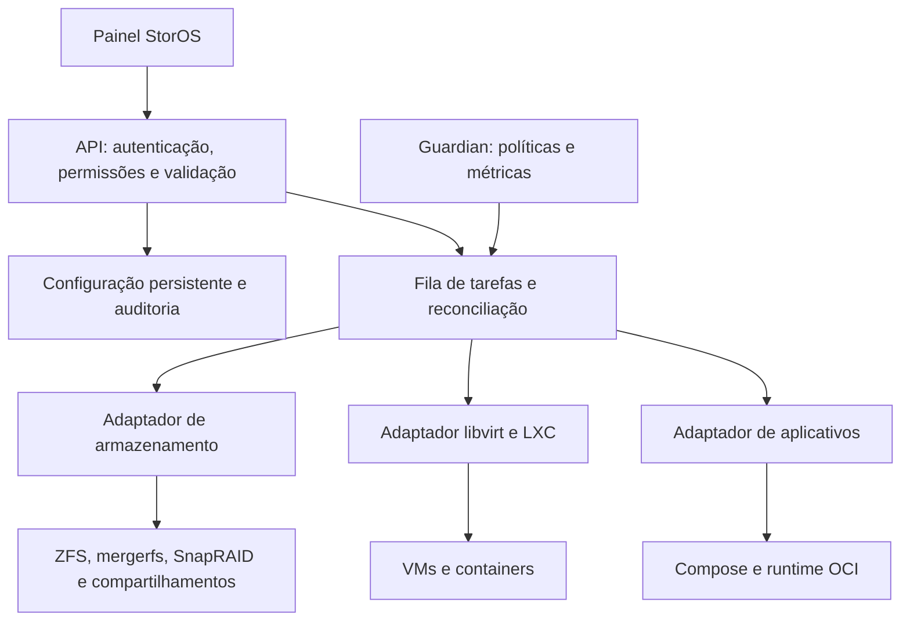

# Arquitetura proposta

Estado: desenho para aprovação, sem implementação. As escolhas definitivas seguem a auditoria da Fase 0.

## Base e estratégia de derivação

Manter Devuan inicialmente, para limitar divergência do MOS. Não introduzir dependência obrigatória de systemd sem decisão explícita sobre a base. Aproveitar frontend Vue e API do MOS onde a revisão permitir; separar serviços privilegiados e criar contratos versionados. Não manter dois gerenciadores concorrentes escrevendo sobre libvirt ou os mesmos pools.

O repositório StorOS será o ponto de entrada do produto, documentação, composição de releases e versões upstream fixadas. Forks/submódulos ou pacotes por componente serão escolhidos na Fase 0, com histórico e créditos preservados. Upstream será acompanhado com inventário de patches próprios, atualização de segurança e testes antes de integrar mudanças. Nada de renomear apenas uma ISO e perder a capacidade de reconstrução.

## Limites entre componentes

A API valida intenção; workers privilegiados executam operações tipadas com argumentos estruturados, sem montar comandos shell a partir da entrada do usuário. Guardian usa a mesma fila/coordenação, com bloqueio por recurso, para não competir com edição manual ou backup.

Estado em três níveis: **desejado**, **gravado** e **observado no sistema**. Cada tarefa recebe ID, resultado e motivo. Uma gravação de formulário só é confirmada após persistir e reler; uma ação de infraestrutura só aparece como aplicada depois da verificação. Timeouts, repetição e reinício não podem duplicar formatação, criação de VM ou alteração de limite.

Inicialmente um banco local transacional, com esquema versionado e cópias consistentes; não compartilhar um arquivo SQLite entre hosts. Métricas têm retenção e local persistente. Cluster exigirá desenho próprio de coordenação na Fase 9.

## Experiência de uso

Navegação proposta: **Visão geral, Arquivos e discos, Máquinas virtuais, Aplicativos, Postos de trabalho, Backups, Rede, Sistema**. Painéis avançados ficam dentro da área correspondente. Os módulos não precisam virar marcas ou telas adicionais para o usuário.

### Instalar e começar

Escolher disco do sistema com modelo/serial/capacidade → criar administrador → configurar rede → revisar o resumo → instalar → escolher uso principal. Discos de dados existentes não são formatados por sugestão automática. O painel explica que pools diferentes têm regras diferentes de expansão e proteção.

### Criar VM com recursos automáticos

Escolher sistema/imagem → armazenamento → quantidade de vCPUs → RAM mínima/inicial/máxima → perfil automático ou manual → revisar reserva do servidor → criar.

Exemplo ilustrativo, não configuração recomendada para todo guest: 16 vCPUs, RAM 4/8/16 GiB. Em automático, o sistema agenda essas vCPUs sem exigir pinning. O teto de quota é equivalente à capacidade escolhida; a contagem visível permanece 16. Balloon pode ajustar RAM na faixa quando houver suporte e métricas confiáveis. O orçamento do host precisa admitir o início; se não houver capacidade, oferecer aguardar ou revisar recursos.

Depois da criação, mostrar no mesmo cartão: máximo configurado, uso atual, limite aplicado, suporte de memória dinâmica, prioridade, última decisão e motivo. Exemplo: “RAM mantida: guest sem estatísticas recentes”. O modo manual continua disponível para jogos, baixa latência e aplicações sensíveis a NUMA.

### Desativar automação

Oferecer ações distintas: **Pausar ajustes**, que mantém o estado atual; **Restaurar configuração anterior**, que verifica identidade e alterações externas; **Alterar limites**, com revisão da capacidade antes de aplicar. Não desfazer uma alteração externa silenciosamente. Se o guest não puder receber RAM de volta naquele momento, mostrar restauração pendente e a razão.

### Escolher um posto de trabalho

Associar usuário → VM → GPU ou cliente remoto → teclado/mouse/áudio → testar. Mostrar dispositivos ocupados e dependências IOMMU. Não permitir atribuir a mesma GPU física exclusiva a dois guests. Um erro de GPU não pode bloquear o acesso administrativo remoto ao servidor.

## Segurança, atualização e recuperação

- Administração local com TLS; autenticação forte e MFA; sessões revogáveis, RBAC e tokens com escopo. Acesso externo é opção explícita.
- Plugins declaram acesso a rede, disco e host. Instalação confiável exige origem/assinatura e compatibilidade; não executar scripts arbitrários de URLs no painel.
- Segredos separados da configuração exportável; diagnóstico remove tokens, senhas e chaves. Backups cifrados têm procedimento de recuperação de chaves.
- Alterações destrutivas exibem disco/pool afetado e exigem confirmação específica; alterações de rede têm mecanismo de retorno se o acesso não for confirmado.
- Atualização registra versão anterior e backup do esquema. Não prometer rollback de pool ZFS após habilitar novos recursos nem rollback dos arquivos do usuário.
- Usar pacotes/motores estabelecidos para storage e virtualização; o StorOS orquestra e verifica, não implementa um filesystem novo.

## Laboratório proposto

Primeiro testar nested virtualization com discos descartáveis. Depois usar pelo menos duas máquinas físicas x86-64, uma com IOMMU/passthrough e, se disponível, uma dual-socket NUMA. A plataforma Xeon do Danilo é candidata a homologação, não hardware já validado. Para NAS, discos descartáveis de tamanhos diferentes e SSD/NVMe separado para VMs; UPS para ensaios controlados.

Não usar os dados de produção do MOS como primeira migração. A migração inicial é instalação separada + importação/cópia verificada + teste de restauração. Publicar resultados por versão do kernel, placa-mãe, NIC, controlador, GPU e driver, sem generalizar uma aprovação a todos os modelos.

## Organização futura sugerida

| Caminho ou componente | Responsabilidade |
| --- | --- |
| docs/ | Roadmap, decisões, arquitetura e guias |
| build/ | Composição de imagem, versões e fontes |
| frontend/ | Interface e fluxos guiados |
| api/ | Contratos, autenticação e estado |
| services/ | Tarefas e adaptadores de storage/compute/backup |
| guardian/ | Políticas de recursos e diagnóstico |
| plugins/ | SDK, manifesto e exemplos |
| tests/ | Contratos, E2E, recuperação e hardware |

Esses diretórios são apenas proposta. Este PR cria exclusivamente documentação.
