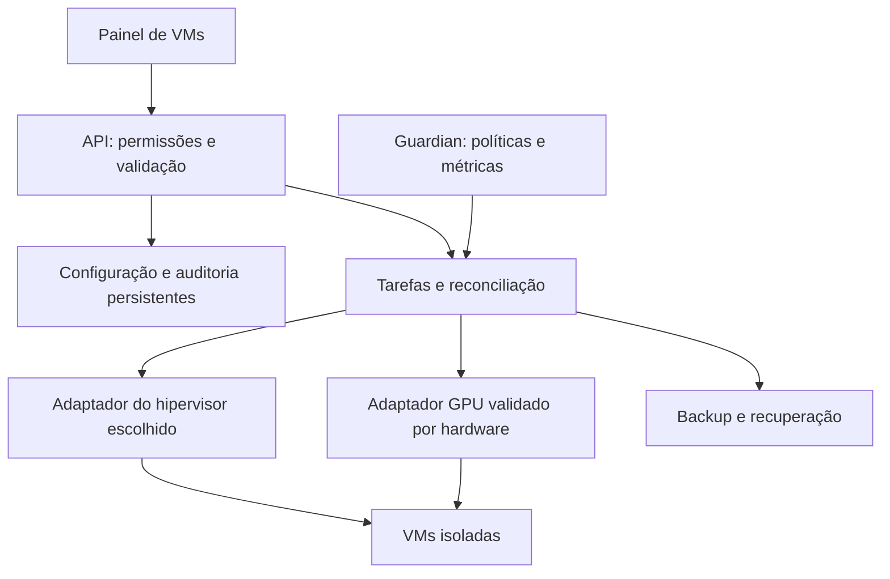

# Arquitetura — revisão 2

**Base de desenvolvimento: Fedora/uCore HCI**, autorizada por Danilo; homologação final pendente. Veja [a decisão e o build](BASE_FEDORA.md). A proposta de adotar MOS/Devuan por padrão foi substituída pelo foco em virtualização e compartilhamento de hardware.

## Escolha por capacidade

Avaliar GPU simultânea comprovada, controle CPU/RAM, guests Linux/Windows, isolamento, manutenção, licenciamento, build e custo. Registrar decisão e evidências antes da implementação.

MOS/Devuan, Linux/KVM, Proxmox e alternativa Windows/Hyper-V são candidatos de avaliação, não afirmações de suporte ao hardware do usuário. Se a escolha mudar a proposta de distribuição aberta, exigir decisão explícita.

## Componentes propostos

Adaptadores usam contratos tipados. Uma autoridade coordena operações por VM/dispositivo; não colocar dois controladores disputando o mesmo recurso.

Estado distingue intenção, gravação e aplicação observada. Gravação exige releitura; aplicação exige verificação no hipervisor. Tarefas têm ID, timeout e recuperação. Restauração verifica identidade da execução e alterações externas.

## Contrato de recursos

| Recurso | Configuração | Estado observado |
| --- | --- | --- |
| CPU | vCPUs, prioridade, capacidade máxima e afinidade opcional | Uso, quota efetiva e disponibilidade do host |
| RAM | Mínimo/inicial/máximo, reserva e margem do guest | Atribuição, disponibilidade e suporte das métricas |
| GPU | Placa/unidade virtual, perfil suportado e prioridade quando disponível | VMs usuárias, driver, VRAM e métricas realmente expostas |

Não inventar percentuais GPU/VRAM configuráveis se o mecanismo não permitir. Compartilhamento simultâneo pode depender de perfis fixos e não implica redistribuição dinâmica de todos os recursos da placa.

## Fluxo central

Criar VM → quantidade de CPU → faixa de RAM → GPU compartilhada compatível → acesso local/remoto → revisar reserva → salvar/criar.

Exemplo ilustrativo: duas VMs com 8 vCPUs e RAM 4/8/16 GiB cada. A capacidade CPU é distribuída por prioridade. A memória inicial precisa caber no orçamento do host; crescimento depende de capacidade confirmada. GPU só oferece combinações verificadas. Não é recomendação para qualquer máquina.

Mostrar limite configurado/aplicado, uso e motivo da última ação. Pausar mantém ajustes; restaurar verifica conflitos e capacidade. Editor não apaga configurações avançadas silenciosamente.

## Segurança e laboratório

Autenticação, papéis, tokens com escopo, logs sem segredos e API sem shell arbitrário. Atualizações com origem/assinatura e recuperação de configuração. Backups informam consistência. Falha GPU mantém um caminho administrativo independente daquela placa.

Usar guests/discos descartáveis. Virtualização aninhada ajuda no contrato/API, mas não certifica GPU. Testes físicos por modelo, firmware, driver, guest e hipervisor. RTX 3080 Ti/RX 550 não estão homologadas. Não alterar produção ou firmware sem autorização específica.

Duas pessoas usam VMs separadas e entrada/áudio independentes; streaming não comprova GPU compartilhada. NAS/apps/cluster ficam fora do caminho crítico.

## Implementação atual

O protótipo começa pelo Containerfile e mídia bootc/QCOW2. O fluxo pretendido é boot direto pela mídia preparada e configuração web, conforme [BOOT_MEDIA.md](BOOT_MEDIA.md). ISO é opcional; a base imutável não comprova execução integral em RAM nem persistência adequada a pendrive comum.

O [agente local](AGENT.md), em Python, consulta `virsh --readonly` com timeout e UUID. O serviço grava snapshot atômico em `/run/storos`, e o estado básico de boot persiste em `/var/lib/storos`.

A fundação da configuração persistente é descrita em [CONFIGURATION.md](CONFIGURATION.md). Ela separa **estado observado** do agente de **intenção/configuração** persistente. `current.json` é o ponteiro ativo; revisões são gravadas por geração antes da troca atômica do estado atual. Atualizações podem exigir `expected_generation` para rejeitar concorrência obsoleta, e rollback cria uma nova geração em vez de reescrever histórico.

O primeiro `storos-web.service` é deliberadamente somente leitura: entrega o snapshot e a configuração ativa, exige autenticação para dados administrativos e bloqueia métodos mutáveis. Por padrão escuta apenas no loopback. A flag `features.vm_write_enabled` é validada como `false`; portanto a existência do painel não concede autoridade para modificar VMs.

Painel e agente têm ciclos de prontidão independentes. O painel **solicita** `storos-agent.service`, mas não serializa seu próprio start atrás dele; após `network.target`, pode inicializar configuração/token e responder `/api/config` enquanto o agente ainda coleta o primeiro snapshot. `/api/status` representa estado observado e pode retornar `503` nesse intervalo. Essa separação impede que aquecimento lento do libvirt bloqueie o caminho administrativo autenticado sem mascarar a indisponibilidade temporária do inventário.

## VM-001 — planner e ledger sem executor

O primeiro estágio de `JOBS` é concretizado pelo contrato descrito em [VM_PLANNER.md](VM_PLANNER.md). `storos_vm.py` recebe uma intenção versionada e um snapshot observado já validado pelo agente e produz um plano determinístico de diferenças. O plano sempre declara `mode=dry_run` e `can_apply=false`; cada item de ação possui `executable=false`.

A identidade da VM é o UUID. Nome, vCPU, memória fixa desejada e estado `running/stopped` formam o contrato mínimo atual. O planner descreve ações como `create_vm`, `set_vcpus`, `set_memory`, `start_vm` e `shutdown_vm`, mas não contém adaptador mutável e não chama `virsh` para executá-las.

A fronteira entre **observação** e **intenção** permanece explícita. A CLI usa o mesmo `read_snapshot` do agente com janela de frescor de 30 segundos. Snapshot `stale` bloqueia reconciliação. Inventário `partial` sem a VM desejada não prova ausência e, por isso, não pode gerar `create_vm`. Ausência de vCPU ou memória configurável observada também gera ação de inspeção bloqueante em vez de suposição.

## VM-002 — intenção persistente e precondições

`storos_vm_store.py` materializa a camada `DB` de intenção por VM em `/var/lib/storos/vm-intents/<uuid>/`. Cada VM possui `current.json`, revisões monotônicas e lock exclusivo próprio. `expected_generation` implementa concorrência otimista; rollback cria nova geração. O conteúdo da intenção é ligado a `intent_sha256`, recalculado em toda leitura para detectar adulteração ou registro incompatível.

O ledger de `JOBS` evolui para schema 2. Cada reconciliação dry-run exige uma intenção já persistida e grava precondições com `intent_generation`, `intent_sha256` e `snapshot_sha256`. A criação da tarefa usa lock por UUID em `/var/lib/storos/tasks/.locks/`, evitando criação concorrente descoordenada para a mesma VM no ledger local.

Esses locks e hashes **não são um executor nem uma autorização**. Servem para tornar a futura fronteira `JOBS → COMPUTE` verificável: qualquer camada mutável futura deverá reler a geração atual, recomputar hashes, obter lock de execução, confirmar capacidade, reler o estado observado imediatamente antes da mutação e rejeitar drift. Se qualquer precondição divergir, a operação deve falhar fechada e gerar novo plano.

A CLI separa inspeção ad hoc (`vm-plan --intent-file`) da reconciliação auditável (`vm-reconcile-dry-run --vm-uuid`), que só aceita intenção persistida. O painel continua somente leitura e não ganhou endpoints mutáveis.

`storos_tasks.py` continua sem worker/executor. Todas as tarefas têm `mode=dry_run`, `executable=false` e o plano mantém `can_apply=false`. `features.vm_write_enabled=false` continua obrigatório.

## WEB-VM-001 — projeção somente leitura do control plane

O painel autenticado passa a projetar os dados já existentes do VM-002 sem ganhar uma camada de comando. `GET /api/vms/intents` lista as intenções persistidas, `GET /api/vms/intents/<uuid>` retorna uma intenção validada e `GET /api/vms/intents/<uuid>/plan` calcula o plano determinístico **em memória** a partir da intenção atual e do snapshot observado; o cálculo não cria tarefa e não grava estado.

O ledger dry-run também pode ser inspecionado por `GET /api/tasks` e `GET /api/tasks/<task_id>`. Os registros expostos continuam carregando `mode=dry_run`, `executable=false` e plano com `can_apply=false`. Métodos `POST`, `PUT`, `PATCH` e `DELETE` continuam respondendo `405` em todo o painel autenticado.

A projeção de plano falha fechada: se o snapshot em `/run/storos/status.json` estiver ausente, ilegível ou incompatível com o planner, o endpoint retorna indisponibilidade em vez de produzir uma ação a partir de estado presumido. O HTML inicial mostra somente resumo de intenções/tarefas e mantém “Escrita em VMs: bloqueada”. Nenhum endpoint desta etapa chama `apply_vm_intent`, `rollback_vm_intent`, `create_dry_run_task` ou qualquer mutação libvirt.

## VM-003A — observação tipada de hardware virtual

A fronteira de observação foi ampliada antes da intenção. Depois de obter identidade/estado/vCPU/RAM, o agente lê a definição persistente do domínio via conexão libvirt somente leitura e converte um subconjunto para `hardware` no snapshot schema 1. A decisão detalhada está em [VM_HARDWARE_OBSERVER.md](VM_HARDWARE_OBSERVER.md).

A observação diferencia firmware, discos e interfaces. Falha apenas nessa etapa não apaga a VM: mantém o registro básico, define `hardware.status=unavailable`, marca o inventário `partial` e registra erro com `scope=hardware`. Assim, “não observado” não vira “ausente”.

Essa camada não certifica hotplug, passthrough, mediated devices, SR-IOV, vGPU ou compartilhamento simultâneo de GPU. Ela também não concede autoridade de escrita ao agente.

## VM-003B — intenção hardware v2 sem executor

O contrato de intenção evolui de forma **backward-compatible**. Schema 1 continua válido e é normalizado no formato original, preservando hashes e revisões históricas. Schema 2 acrescenta um bloco `hardware` estreito, descrito em [VM_PLANNER.md](VM_PLANNER.md).

O v2 gerencia apenas:

- modo abstrato de firmware `bios|efi`, sem caminho de loader/NVRAM do host;
- discos identificados por `target`, limitados a bus `virtio|sata|scsi`, fonte local `file|block`, formato `raw|qcow2`, readonly e ordem de boot;
- interfaces identificadas por MAC, limitadas a `network` ou `bridge`, source correspondente e modelo explícito.

As listas de discos/interfaces são **subconjuntos gerenciados**, não inventários exclusivos. Hardware observado extra não produz remoção automática. Targets/MACs duplicados são rejeitados, e listas são normalizadas deterministicamente para estabilizar hashes.

Para uma VM existente, qualquer intenção hardware v2 depende de `hardware.status=ok`. Se o agente não conseguiu observar hardware, o planner gera `inspect_hardware` bloqueante e não infere mudança. Firmware desconhecido ou dispositivo observado insuficiente/ambíguo também gera inspeção bloqueante.

Diferenças válidas podem ser descritas como `set_firmware_mode`, `attach_disk`, `reconfigure_disk`, `attach_interface` e `reconfigure_interface`; todas continuam com `executable=false`. O plano continua `mode=dry_run` e `can_apply=false`. Para uma VM ausente em inventário saudável, `create_vm.after` pode carregar o hardware v2 apenas como descrição do estado desejado.

Secure Boot, enrolled keys, regeneração de NVRAM, detach automático, pinning/NUMA, hotplug, passthrough e GPU permanecem fora do contrato VM-003B. Em especial, o atributo `loader secure` do libvirt não deve ser usado como autorização para inferir que Secure Boot está efetivamente habilitado; essa política será modelada apenas quando existir contrato e verificação próprios.

## Fronteira para escrita futura

A futura passagem de `JOBS` para `COMPUTE` será uma camada separada. Antes de existir escrita real, ela deverá validar, no mínimo: autenticação/autorização, feature gate explícito, lock por VM e recurso, geração/hash esperado, capacidade do host, snapshot fresco, releitura imediatamente anterior à mutação, timeout, resultado observado e auditoria persistente. Nenhum desses requisitos deve ser inferido como concluído apenas porque VM-002 persiste intenção e precondições ou porque VM-003B descreve hardware em dry-run.
